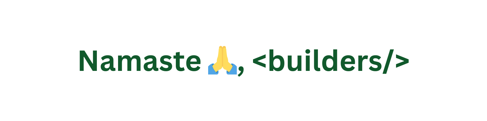

">

**Namaste** is a way to greet someone in India. Hi, I'm **Ayush Warrier**. I like designing clean and simple interfaces, and I'm learning Web Engineering so I can build the interfaces I design in the future.

### 🛠️ Tech Stack

  
  
  
  
  
  
  

### 🌐 Connect With Me

### ✍️ Blog Posts

• <a href="https://medium.com/@your-link/how-to-create-a-clean-github-profile-readme" target="_blank">
  How to Create a Clean GitHub Profile README
</a>

• <a href="https://medium.com/@your-link/best-ui-ux-design-resources-for-beginners" target="_blank">
  Best UI/UX Design Resources for Beginners
</a>

### ☕ Support:

  

